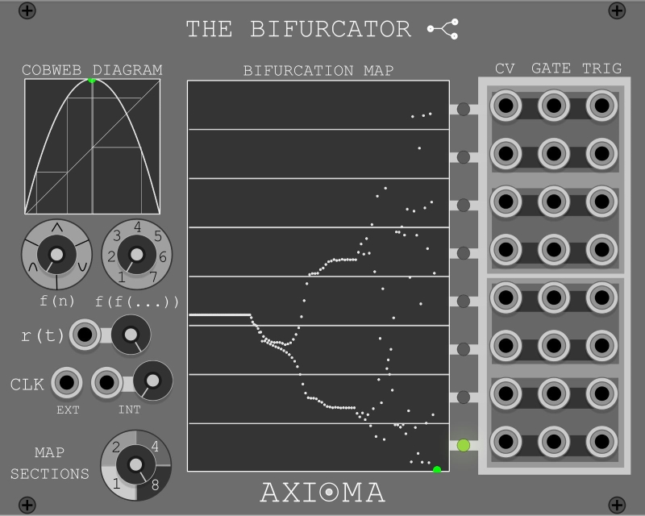
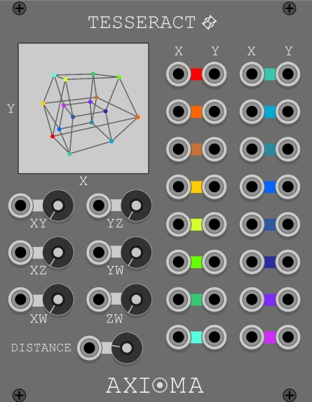
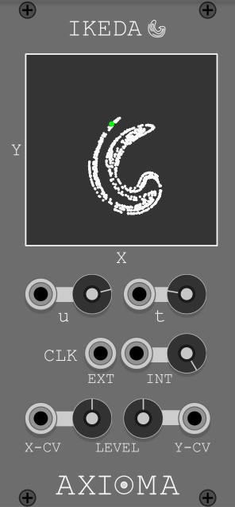
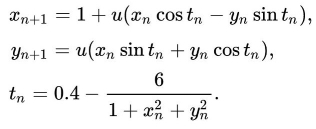

# Axioma VCV Rack modules

The Axioma plugin was developed for the open-source [VCV Rack](https://vcvrack.com/) library, using existing C++ templates provided in the [VCV Manual](https://vcvrack.com/manual/PluginDevelopmentTutorial). The current list of Axioma modules is the following:

  - [The Bifurcator](#thebifurcator)
  - [Tesseract](#tesseract)
  - [Ikeda](#ikeda)

A few patch examples (with VCV fundamental modules) can be found in the [examples](https://github.com/kauewerner/Axioma/tree/main/examples) folder.

##  The Bifurcator

This module can be used as a sequencer to generate `CV`, `GATE` and `TRIGGER` outputs according to the mapped positions on the bifurcation map. The positions are obtained based on iterations of a selected function type `f(n)`. The available function options are: 

- [logistic](https://en.wikipedia.org/wiki/Logistic_map) 
- [tent](https://en.wikipedia.org/wiki/Tent_map)
- [parabola](https://en.wikipedia.org/wiki/Parabola)

Each function can also iterate itself a number of times `f(f(...))`. The module contains a `COBWEB DIAGRAM` providing a visualization of the function shape and the last iteration points. The bifuration parameter `r(t)` can be varied dynamically changing the behavior of each function and creating a specific distribution on the `BIFURCATION MAP` over time. The module contains both an input for external clock `EXT` and internal clock `INT` with input CV control. The iterated function is computed at each clock time. There are 4 options to set a mapping configuration of number of sections: 1,2 4, and 8. The `CV`, `GATE` and `TRIG` outputs are generated when the position reaches the corresponding map section where the port is located. The output `CV` level range will be from minimum (0V) to maximum (10V) within each map section.

##  Tesseract

The Tesseract module provides output CV control (0 - 10V) based on the position of each vertex of a rotating Tesseract projected on a 2D space (X,Y). The rotation speed of each plane in the 4D space (`XY`,`YZ`,`XZ`,`XW`,`YW` and `ZW`) can be controlled by input CV and/or the available Knobs. The perspective `DISTANCE` can also be set (CV and Knob) and provides a change in the voltage dynamic range of the output CVs

##  Ikeda

The Ikeda module is based on the dynamic system map proposed by [Kensuke Ikeda](https://en.wikipedia.org/wiki/Ikeda_map) which describes a chaotic behavior within a specific parameter range. The 2D example of the model used in this module can be described by the following equations:

The main parameter is the `u` value, which can be altered in the module and it is restricted to the 0.6 - 0.9 range (clamped). An additional parameter `t` was added to set a different weight ( 0.25 - 3.5 ) in the tn computation, which leads to a reshape of the chaotic maps. Output CVs are generated based on the (X,Y) positions obtained with this model. Each output CV level can be weighted by the available `LEVEL` knobs.

## Further information

In case of any problem please add an [issue](https://github.com/kauewerner/Axioma/issues) to the tracker of this repository. Please also feel free to contact me at kaue.werner@gmail.com.  
